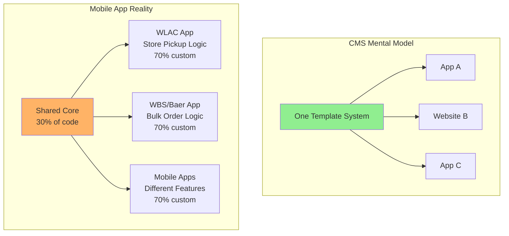
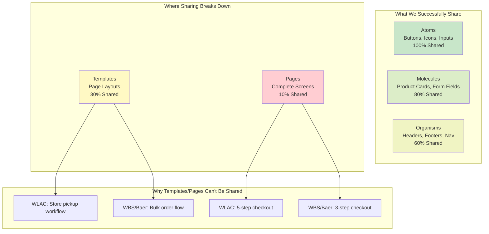
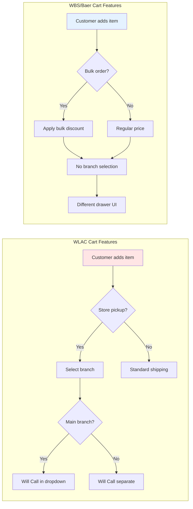
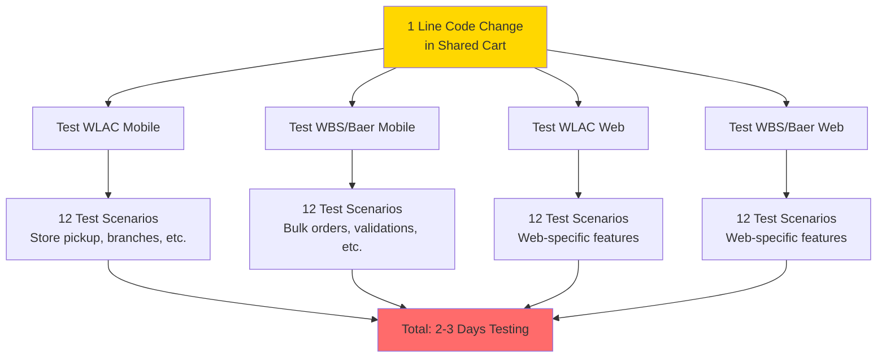
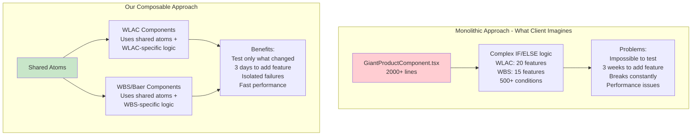
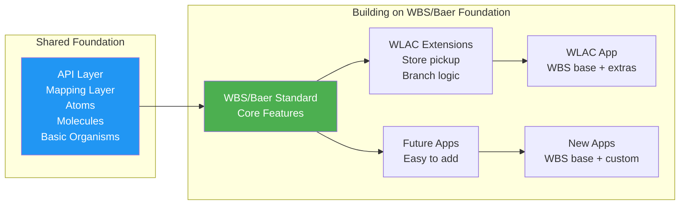
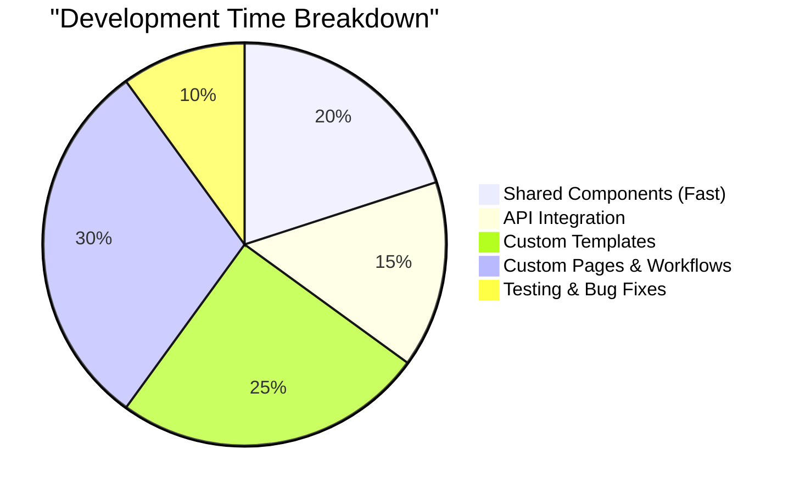
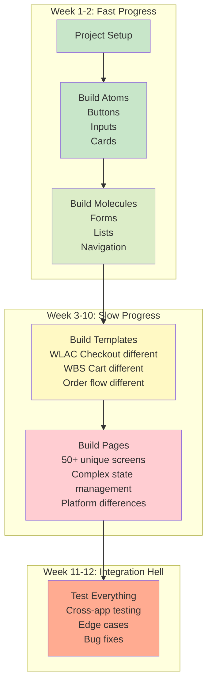
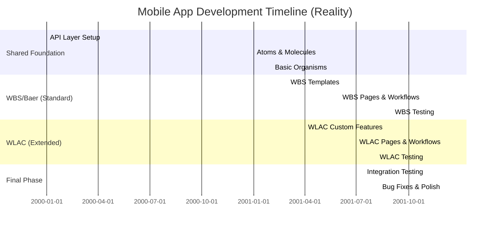
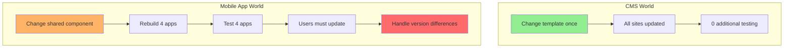

# Why Mobile Apps Take 3+ Months: A Business Perspective

## 1. Expectation vs. Reality



## 2. What We Actually Share (Atomic Design)



### Business Translation:
```
SHARED (Fast to build):
- Button component → Used 100+ times across all apps
- Product card base → Reused with small tweaks
- Navigation structure → Same pattern, different items

NOT SHARED (Time consuming):
- Checkout page → WLAC has store pickup, WBS doesn't
- Cart template → Completely different workflows
- Order history → Different data, different features
```

## 3. The "Simple" Shopping Cart Example



## 4. The Testing Multiplication Problem



## 5. Our Architecture: Composability vs Monolith



### Code Example - Composable Approach:
```
// ✅ GOOD: Shared Button Atom
Button = (text, onClick) => {
    return <button onClick={onClick}>{text}</button>
}

// ✅ GOOD: WLAC uses shared button in its way
WLACCheckout = () => {
    return (
        <div>
            <StorePickupSelector />
            <Button text="Proceed to Pickup" onClick={handlePickup} />
        </div>
    )
}

// ✅ GOOD: WBS uses same button differently  
WBSCheckout = () => {
    return (
        <div>
            <BulkOrderSummary />
            <Button text="Complete Order" onClick={handleBulk} />
        </div>
    )
}

// ❌ BAD: Giant component with everything
GiantCheckout = (tenant) => {
    if (tenant === 'WLAC') {
        // 500 lines of WLAC code
    } else if (tenant === 'WBS') {
        // 400 lines of WBS code
    }
    // Nightmare to maintain!
}
```

## 6. Our Current Standardization Strategy



### What This Means:
```
WE ARE BUILDING:
- WBS/Baer as the standard template
- WLAC as "WBS + custom features"
- Shared components library (atoms/molecules)
- Unified API and mapping layers

WE ARE NOT:
- Making everything identical
- Forcing WLAC into WBS structure
- Creating one giant app for all
```

## 7. Where Development Time Actually Goes





## 8. The REAL Timeline Breakdown



## Executive Summary

> 📊 **[View Work Concentration Analysis](concentration.MD)** - Visual comparison of WLAC vs WBS complexity

### Why Mobile Apps ≠ CMS (The Business Reality)



### What We're Actually Building:

1. **Shared Foundation (30% of work - 3 weeks)**
    - API connections
    - Basic UI components (buttons, cards, forms)
    - Common utilities

2. **Custom Business Logic (70% of work - 9 weeks)**
    - WLAC store pickup workflow (unique)
    - WBS/Baer bulk ordering (unique)
    - Different checkout processes
    - Different page layouts
    - Different user journeys

### The Bottom Line:

**3 Months is Accurate Because:**
- We ARE reusing components where possible (30% shared)
- We ARE building on WBS/Baer as standard
- We ARE using composable architecture (faster than monolithic)
- We CANNOT share business logic (store pickup != bulk orders)
- We CANNOT share page templates (different workflows)
- We MUST test each app separately (different features)

**If we tried to share everything:**
- Development time: 3 months → 6 months
- Maintenance time: 3 days → 3 weeks per feature
- Bug rate: 10x higher
- Performance: 50% slower

### Recommendation:
Accept that 70% of each app is necessarily unique. 
The 30% we're sharing is already saving months of work. 
Forcing more sharing would paradoxically make development slower, not faster.
