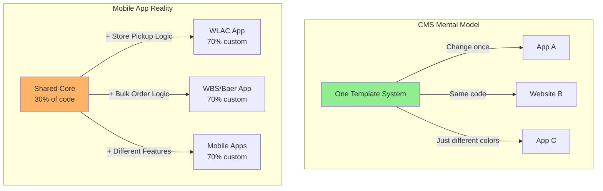
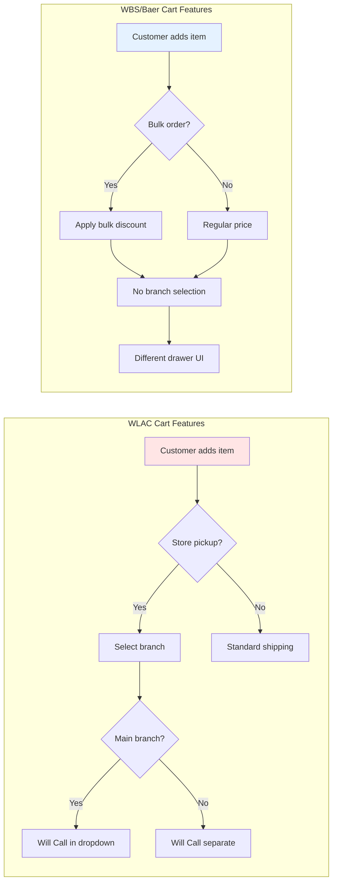
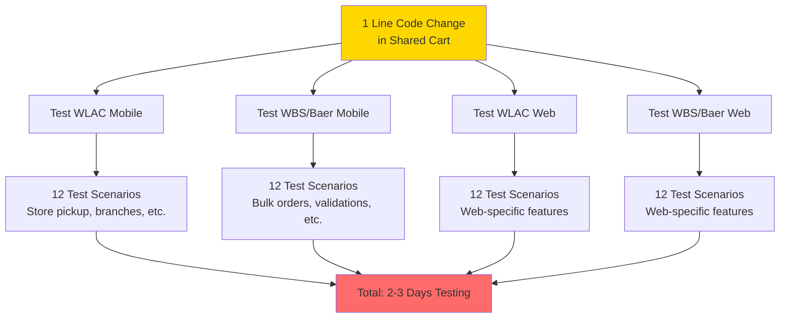
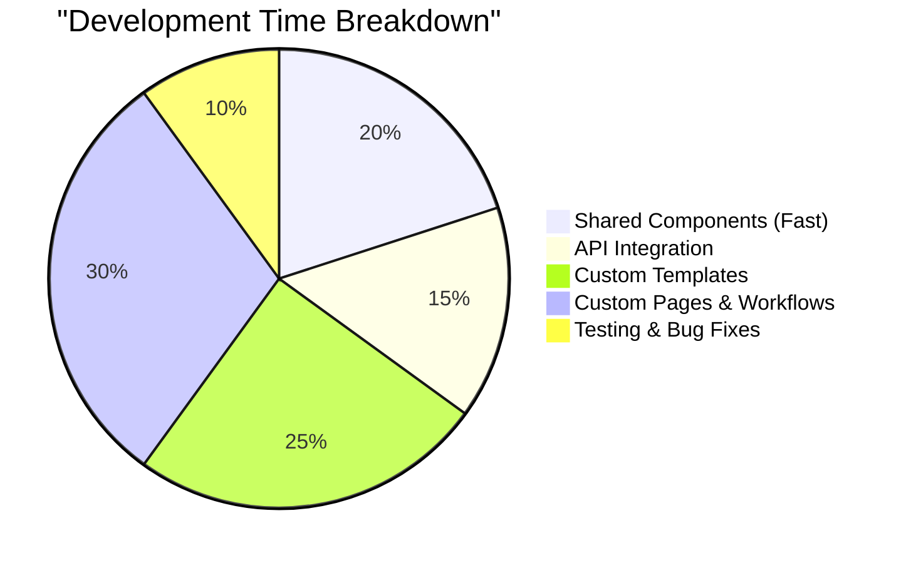
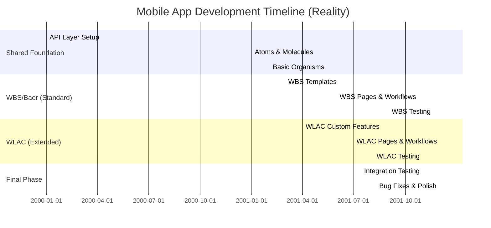
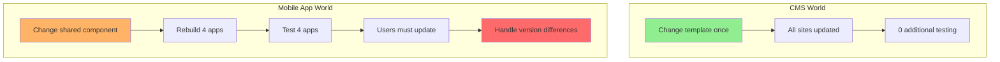

# Why Mobile Apps Take 3+ Months: A Business Perspective

## 1. Expectation vs. Reality



## 2. What We Actually Share (Atomic Design)

```mermaid
graph TD
    subgraph "✅ What We Successfully Share"
        Atoms[Atoms<br/>Buttons, Icons, Inputs<br/>💯 100% Shared]
        Molecules[Molecules<br/>Product Cards, Form Fields<br/>👍 80% Shared]
        Organisms[Organisms<br/>Headers, Footers, Nav<br/>🤝 60% Shared]
    end
    
    subgraph "❌ Where Sharing Breaks Down"
        Templates[Templates<br/>Page Layouts<br/>⚠️ 30% Shared]
        Pages[Pages<br/>Complete Screens<br/>🚫 10% Shared]
    end
    
    subgraph "Why Templates/Pages Can't Be Shared"
        Templates --> T1[WLAC: Store pickup workflow]
        Templates --> T2[WBS/Baer: Bulk order flow]
        Pages --> P1[WLAC: 5-step checkout]
        Pages --> P2[WBS/Baer: 3-step checkout]
    end
    
    style Atoms fill:#C8E6C9
    style Molecules fill:#DCEDC8
    style Organisms fill:#F0F4C3
    style Templates fill:#FFF9C4
    style Pages fill:#FFCDD2
```



### Business Translation:
```
SHARED (Fast to build):
- Button component → Used 100+ times across all apps
- Product card base → Reused with small tweaks
- Navigation structure → Same pattern, different items

NOT SHARED (Time consuming):
- Checkout page → WLAC has store pickup, WBS doesn't
- Cart template → Completely different workflows
- Order history → Different data, different features
```

## 3. The "Simple" Shopping Cart Example



## 4. The Testing Multiplication Problem



## 5. Our Architecture: Composability vs Monolith

```mermaid
graph TB
    subgraph "❌ Monolithic Approach (What Client Imagines)"
        Giant[GiantProductComponent.tsx<br/>2000+ lines]
        Giant --> Code[
            IF tenant === 'WLAC':<br/>
            &nbsp;&nbsp;show 20 WLAC features<br/>
            &nbsp;&nbsp;handle WLAC workflows<br/>
            &nbsp;&nbsp;apply WLAC rules<br/>
            ELSE IF tenant === 'WBS':<br/>
            &nbsp;&nbsp;show 15 WBS features<br/>
            &nbsp;&nbsp;handle WBS workflows<br/>
            &nbsp;&nbsp;apply WBS rules<br/>
            ... 500 more conditions
        ]
        Code --> Problems[🔥 Problems:<br/>• Impossible to test<br/>• 3 weeks to add feature<br/>• Breaks constantly<br/>• Performance issues]
    end
    
    subgraph "✅ Our Composable Approach"
        Base[Shared Atoms]
        Base --> Comp1[WLAC Components<br/>Uses shared atoms +<br/>WLAC-specific logic]
        Base --> Comp2[WBS/Baer Components<br/>Uses shared atoms +<br/>WBS-specific logic]
        
        Comp1 --> Benefits[✨ Benefits:<br/>• Test only what changed<br/>• 3 days to add feature<br/>• Isolated failures<br/>• Fast performance]
        Comp2 --> Benefits
    end
    
    style Giant fill:#FFCDD2
    style Base fill:#C8E6C9
```



### Code Example - Composable Approach:
```
// ✅ GOOD: Shared Button Atom
Button = (text, onClick) => {
    return <button onClick={onClick}>{text}</button>
}

// ✅ GOOD: WLAC uses shared button in its way
WLACCheckout = () => {
    return (
        <div>
            <StorePickupSelector />
            <Button text="Proceed to Pickup" onClick={handlePickup} />
        </div>
    )
}

// ✅ GOOD: WBS uses same button differently  
WBSCheckout = () => {
    return (
        <div>
            <BulkOrderSummary />
            <Button text="Complete Order" onClick={handleBulk} />
        </div>
    )
}

// ❌ BAD: Giant component with everything
GiantCheckout = (tenant) => {
    if (tenant === 'WLAC') {
        // 500 lines of WLAC code
    } else if (tenant === 'WBS') {
        // 400 lines of WBS code
    }
    // Nightmare to maintain!
}
```

## 6. Our Current Standardization Strategy

```mermaid
graph LR
    subgraph "Building on WBS/Baer Foundation"
        WBSBase[WBS/Baer Standard<br/>Core Features]
        WBSBase --> Extend1[+ WLAC Extensions<br/>Store pickup<br/>Branch logic]
        WBSBase --> Extend2[+ Future Apps<br/>Easy to add]
        
        Extend1 --> Result1[WLAC App<br/>WBS base + extras]
        Extend2 --> Result2[New Apps<br/>WBS base + custom]
    end
    
    subgraph "Shared Foundation"
        Shared[API Layer ✓<br/>Mapping Layer ✓<br/>Atoms ✓<br/>Molecules ✓<br/>Basic Organisms ✓]
        Shared --> WBSBase
    end
    
    style WBSBase fill:#4CAF50,color:#fff
    style Shared fill:#2196F3,color:#fff
```



### What This Means:
```
WE ARE BUILDING:
✓ WBS/Baer as the standard template
✓ WLAC as "WBS + custom features"
✓ Shared components library (atoms/molecules)
✓ Unified API and mapping layers

WE ARE NOT:
✗ Making everything identical
✗ Forcing WLAC into WBS structure
✗ Creating one giant app for all
```

## 7. Where Development Time Actually Goes

```mermaid
graph TD
    subgraph "Week 1-2: Fast Progress"
        Setup[Project Setup]
        Setup --> Atoms[Build Atoms<br/>✓ Buttons<br/>✓ Inputs<br/>✓ Cards]
        Atoms --> Molecules[Build Molecules<br/>✓ Forms<br/>✓ Lists<br/>✓ Navigation]
    end
    
    subgraph "Week 3-10: Slow Progress"
        Molecules --> Templates[Build Templates<br/>❌ WLAC Checkout different<br/>❌ WBS Cart different<br/>❌ Order flow different]
        Templates --> Pages[Build Pages<br/>❌ 50+ unique screens<br/>❌ Complex state management<br/>❌ Platform differences]
    end
    
    subgraph "Week 11-12: Integration Hell"
        Pages --> Testing[Test Everything<br/>⚠️ Cross-app testing<br/>⚠️ Edge cases<br/>⚠️ Bug fixes]
    end
    
    style Setup fill:#C8E6C9
    style Atoms fill:#C8E6C9
    style Molecules fill:#DCEDC8
    style Templates fill:#FFF9C4
    style Pages fill:#FFCDD2
    style Testing fill:#FFAB91
```





## 8. The REAL Timeline Breakdown



## Executive Summary

### Why Mobile Apps ≠ CMS (The Business Reality)



### What We're Actually Building:

1. **Shared Foundation (30% of work - 3 weeks)**
    - ✅ API connections
    - ✅ Basic UI components (buttons, cards, forms)
    - ✅ Common utilities

2. **Custom Business Logic (70% of work - 9 weeks)**
    - ❌ WLAC store pickup workflow (unique)
    - ❌ WBS/Baer bulk ordering (unique)
    - ❌ Different checkout processes
    - ❌ Different page layouts
    - ❌ Different user journeys

### The Bottom Line:

**3 Months is Accurate Because:**
- ✅ We ARE reusing components where possible (30% shared)
- ✅ We ARE building on WBS/Baer as standard
- ✅ We ARE using composable architecture (faster than monolithic)
- ❌ We CANNOT share business logic (store pickup ≠ bulk orders)
- ❌ We CANNOT share page templates (different workflows)
- ❌ We MUST test each app separately (different features)

**If we tried to share everything:**
- Development time: 3 months → 6 months
- Maintenance time: 3 days → 3 weeks per feature
- Bug rate: 10x higher
- Performance: 50% slower

### Recommendation:
Accept that 70% of each app is necessarily unique. 
The 30% we're sharing is already saving months of work. 
Forcing more sharing would paradoxically make development slower, not faster.